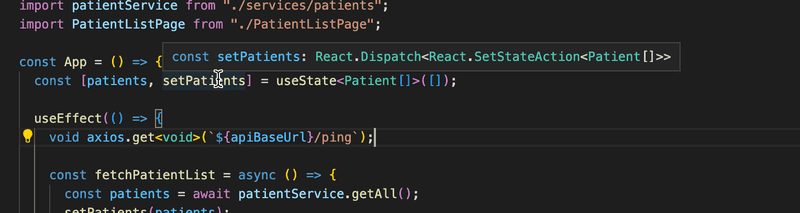

# Patentior Typescript React Frontend 


**What to do when you dive into an old project at a company or an open-source project ?**

1. Start your research by reading the `README.md` in the root of the repository.
2. Take a peek at the `package.json`.
3. Try looking for `types.ts` or something similar to get started.
4. Browse the folder structure to get some insight into the application's functionality and/or the architecture used.
5. If the project has unit, integration or end-to-end tests, reading those is most likely beneficial.
6. Start the application and click around to verify you have a functional development environment.


> The more code you read, the better you will be at understanding it
> You will most likely read far more code than you are going to produce throughout your life


## Setting the Prop Types for components using the setState() as a function

```javascript
     const [patients, setPatients] = useState<Patient[]>([]);

     // passed to :
  
     <PatientListPage
                patients={patients}
                setPatients={setPatients}
              />

    // Prop Types of PatientListPage

    interface Props {
      patients : Patient[]
      setPatients: React.Dispatch<React.SetStateAction<Patient[]>>
    }
    
    const PatientListPage = ({ patients, setPatients } : Props ) => { 
      // ...
    }


```

---

_So the function `setPatients` has type `React.Dispatch<React.SetStateAction<Patient[]>>`_   

_We can see the type in the editor when we hover over the function :_



Always refer to _**[React Typescript CheatSheet](https://react-typescript-cheatsheet.netlify.app/docs/basic/getting-started/basic_type_example/#basic-prop-types-examples "React Typescript CheatSheet")**_, to find out about the types in react , if ever confused.